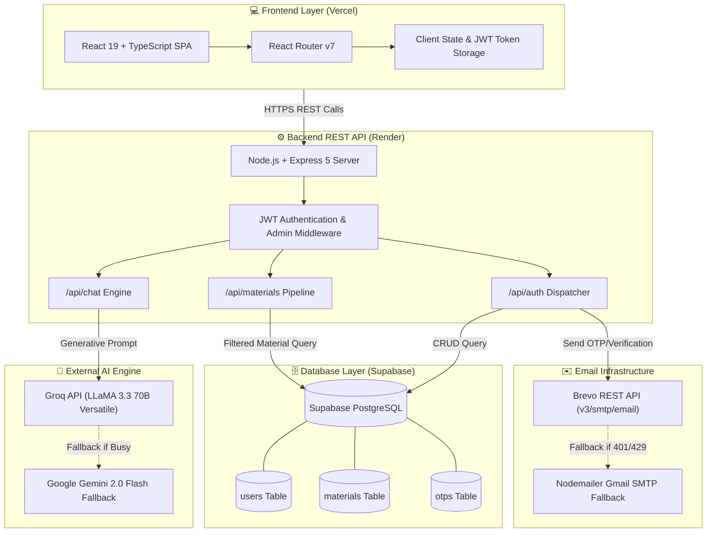
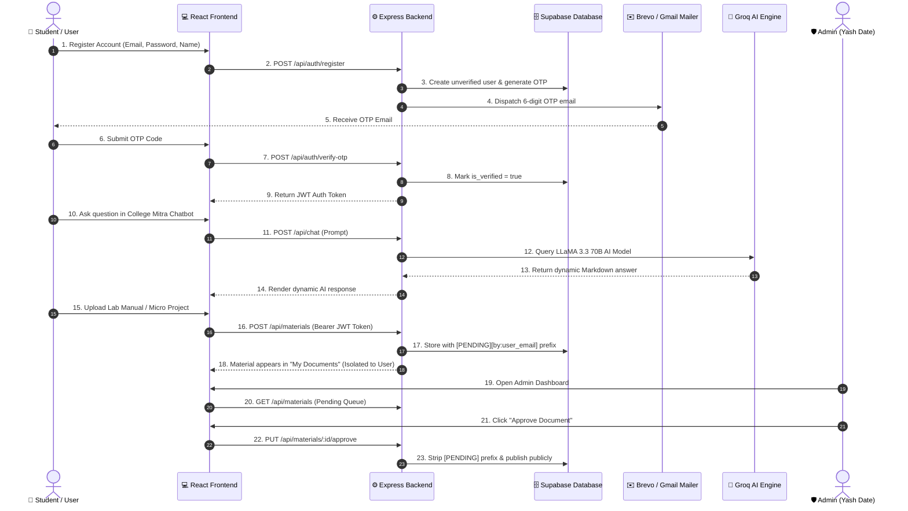
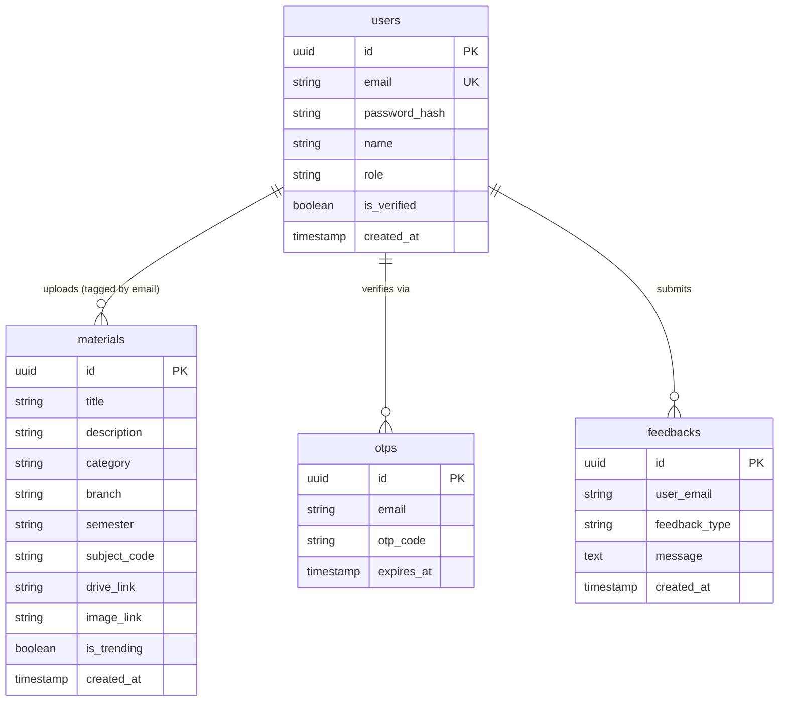

# 🎓 College Sahayak — Full-Stack Academic & AI Web Platform

//
> **Official MSBTE Diploma & Engineering Academic Ecosystem, AI Counselor (College Mitra), Curriculum Repository & Enterprise Web Infrastructure.**

[](https://github.com/YashDate31/Internship-2k26)
[](https://college-sahayak.vercel.app)
[](https://college-sahayak.onrender.com)
[](https://supabase.com)
[](https://groq.com)
[](https://github.com/YashDate31)

---

## 🧑‍💻 Solo Developer & Individual Project Notice

> [!IMPORTANT]
> **This entire ecosystem — including full-stack frontend architecture, REST API backend, database schema, AI chatbot integration, email dispatch system, data analytics dashboard, and deployment pipelines — was designed, developed, deployed, and maintained individually by Yash Date.**

* **Developer Name:** **Yash Vijay Date**
* **Enrollment Number:** `24210270230`
* **Institute:** Government Polytechnic Awasari (Khurd)
* **Department:** Computer Engineering
* **Industry Partner:** Somayu Infotech (Mentor: Mr. Yuvraj Hande Sir)
* **Academic Leadership:** HOD Mrs. Megha Yawalkar Mam | Principal Mr. Vitthal Bandal Sir
* **Internship Period:** 25th May 2026 to 23rd August 2026 (12 Weeks)

---

## 📊 Current Build & Deployment Status

This table represents the actual production build status, verified live across all production environments.

| Subsystem / Track | Primary Tech Stack | Owner / Lead | Live Status & Deployment |
| :--- | :--- | :--- | :--- |
| **Frontend Storefront** | React 19 + TypeScript + Vite + Vanilla CSS | **Yash Date** | 🟢 **Deployed Live on Vercel** ([Live App](https://college-sahayak.vercel.app)) |
| **Backend REST API** | Node.js + Express 5 + JWT + Bcrypt | **Yash Date** | 🟢 **Deployed Live on Render** ([Live API](https://college-sahayak.onrender.com)) |
| **Database & Auth** | Supabase (PostgreSQL) + RLS Policies | **Yash Date** | 🟢 **Configured & Verified in Production** |
| **AI Counselor Engine** | Groq LLaMA 3.3 70B + Gemini 2.0 Flash Fallback | **Yash Date** | 🟢 **Serving Live Queries (0% Static Fallbacks)** |
| **Email Dispatcher** | Brevo REST API + Gmail SMTP Multi-Tier | **Yash Date** | 🟢 **Verified & Delivering OTPs** |
| **Project 01 (Amazon E-Shop)** | HTML5, CSS3, JavaScript ES6+, Vercel | **Yash Date** | 🟢 **Deployed Live** ([Amazon Platform](https://amazon-e-shop.vercel.app)) |
| **Project 02 (Hospital BI)** | Power BI, Data Analytics, DAX Queries | **Yash Date** | 🟢 **Completed & Interactive Report** |

### 🔗 Live Production Endpoints:
* 🌐 **Frontend Web App:** [https://college-sahayak.vercel.app](https://college-sahayak.vercel.app)
* ⚙️ **Backend REST API:** [https://college-sahayak.onrender.com](https://college-sahayak.onrender.com)
* 🛒 **E-Commerce Web Project:** [https://amazon-e-shop.vercel.app](https://amazon-e-shop.vercel.app)

---

## 🏗️ Architecture & Data Flow

### High-Level System Architecture



### Plain-English Architecture Explanation
1. **Frontend-First SPA:** The user interacts with a responsive React 19 single-page application built with Vite and TypeScript.
2. **Stateless API & Role-Based Auth:** Authentication is managed using custom JWT tokens generated upon secure password verification (`bcryptjs`). Requests carry bearer tokens evaluated by express middlewares.
3. **Resilient AI Pipeline:** When a user queries **College Mitra**, the backend calls **Groq's LLaMA 3.3 70B** model. If rate limits occur, it seamlessly fails over to **Google Gemini 2.0 Flash**, ensuring zero downtime or static generic error text.
4. **User Material Isolation:** Student uploads are tagged with `[PENDING][by:user_email]` titles. The backend isolates uploads so users only see their own pending materials, while the Admin Dashboard features a full moderation and approval queue.
5. **Multi-Tier Email Fallback:** Account verification emails attempt delivery via Brevo REST API v3. If the primary key is rate-limited or unconfigured, the system automatically engages Gmail SMTP (`nodemailer`) and logs emergency OTPs to the console.

---

## 📁 Repository & Project Structure

```text
Internship 2026/
├── Final Project/                    # 🚀 Primary Full-Stack Web Application
│   ├── backend/                      # Node.js + Express REST API
│   │   ├── config/                   # Supabase client & environment configuration
│   │   ├── middleware/               # Auth & admin JWT validation middlewares
│   │   ├── routes/                   # API Route Handlers
│   │   │   ├── auth.js               # Signup, Login, OTP verification, Reset Password, Admin role
│   │   │   ├── chat.js               # Groq LLaMA 3.3 70B & Gemini AI Integration
│   │   │   ├── materials.js          # Material upload, moderation, user isolation, approval
│   │   │   └── user.js               # Profile & user stats management
│   │   ├── utils/                    # Helper utilities (sendEmail dispatcher)
│   │   ├── .env                      # Production environment keys (Supabase, Groq, Brevo)
│   │   ├── package.json              # Backend dependencies
│   │   └── server.js                 # Express server bootstrap & middleware pipeline
│   │
│   └── frontend/                     # React 19 + TypeScript Single Page Application
│       ├── public/                   # Static assets & favicon
│       ├── src/                      # Application Source
│       │   ├── components/           # Reusable UI Components (Navbar, Footer, Chatbot, UploadModal)
│       │   ├── pages/                # Page Views
│       │   │   ├── Home.tsx          # Landing Hero, Search, Stats, Trending Items
│       │   │   ├── Curriculum.tsx    # MSBTE K-Scheme & I-Scheme Subject Directory
│       │   │   ├── LabManuals.tsx    # Practical Manual Solutions & Downloads
│       │   │   ├── MicroProjects.tsx # Source Code & Project Report Bundles
│       │   │   ├── Notes.tsx         # Unit-wise Lecture Notes & PDF Repositories
│       │   │   ├── AdminDashboard.tsx# Moderation Queue, User Role Promotion, Uploads Table
│       │   │   ├── MyReports.tsx     # Isolated Student Submissions Workspace
│       │   │   ├── Assignments.tsx   # Semester Assignments & Solved Solutions
│       │   │   ├── QuestionPapers.tsx# Previous Year Winter/Summer MSBTE Papers
│       │   │   └── Feedback.tsx      # User Feedback Submission
│       │   ├── lib/                  # Firebase & API utility configurations
│       │   ├── App.tsx               # Client Routes & Protected Route Wrappers
│       │   └── main.tsx              # Application Entrypoint
│       ├── package.json              # Frontend dependencies
│       └── vite.config.ts            # Vite Build Configuration
│
├── Intership Documentation/         # 📄 Comprehensive Industrial Report & Documentation
│   ├── Yash_Vijay_Date_Project_Report.docx  # 3.86 MB Complete Customized Report
│   ├── Yash_Vijay_Date_Project_Report.pdf   # 1.90 MB Pixel-Perfect PDF Report
│   └── Yash_Vijay_Internship_Portfolio.html# Interactive Portfolio Showcase
│
├── Data Analytics Power BI/          # 📊 Project 02: Hospital ER Analytics Dashboard
│   └── Hospital_ER_Dashboard.pbix    # Interactive Business Intelligence Report
│
├── website/                          # 🛒 Project 01: Amazon E-Commerce Platform
│   ├── index.html                    # E-Commerce Landing & Product Catalog
│   ├── cart.html                     # Interactive Shopping Cart
│   └── checkout.html                 # Payment & Order Confirmation
│
├── Internship_Daily_Diary.md         # 📅 12-Week Daily Learning & Activity Record
└── README.md                         # 📖 Project Master Documentation
```

---

## 🗺️ How a User's Journey Works



---

## 💻 Tech Stack Breakdown

| Layer | Technologies & Tools Used |
| :--- | :--- |
| **Frontend UI** | **React 19**, **TypeScript**, Vite 8, React Router v7, Lucide React Icons, Vanilla CSS Design System |
| **Backend API** | **Node.js**, **Express 5**, JavaScript (CommonJS), JsonWebToken, BcryptJS, CORS, Rate Limiters |
| **Database & Auth** | **Supabase (PostgreSQL)**, Row Level Security (RLS), Custom JWT Authentication |
| **Artificial Intelligence** | **Groq API** (`llama-3.3-70b-versatile`), **Google Gemini 2.0 Flash** API Fallback |
| **Email Infrastructure** | **Brevo REST API v3**, **Nodemailer** (Gmail SMTP Fallback Pipeline) |
| **Data Analytics** | **Microsoft Power BI Desktop**, DAX Queries, ETL Data Pipelines |
| **Hosting & Cloud** | **Vercel** (Frontend SPA & E-Shop), **Render** (Node.js Web Service) |
| **Version Control** | **Git**, **GitHub** (Clean Commits, Branching, Rebase Pipelines) |

---

## 🗄️ Database Schema (Supabase PostgreSQL)



---

## 📡 API Reference Endpoints

### 🔐 Authentication Endpoints (`/api/auth`)
| Method | Endpoint | Access | Description |
| :--- | :--- | :--- | :--- |
| `POST` | `/api/auth/register` | Public | Registers a new student account & dispatches verification OTP |
| `POST` | `/api/auth/verify-otp` | Public | Validates OTP and activates user account (`is_verified = true`) |
| `POST` | `/api/auth/login` | Public | Authenticates user credentials and returns JWT bearer token |
| `POST` | `/api/auth/forgot-password` | Public | Initiates password reset procedure and sends OTP email |
| `POST` | `/api/auth/reset-password` | Public | Verifies OTP and updates user password hash in Supabase |
| `POST` | `/api/auth/make-admin` | Admin | Grants admin role privileges to specified user email |

### 📚 Study Materials Endpoints (`/api/materials`)
| Method | Endpoint | Access | Description |
| :--- | :--- | :--- | :--- |
| `GET` | `/api/materials` | Public | Retrieves all approved study materials across all categories |
| `POST` | `/api/materials` | User | Submits study material (stamped with `[PENDING][by:email]`) |
| `PUT` | `/api/materials/:id/approve` | Admin | Strips pending tags and publishes material publicly |
| `DELETE` | `/api/materials/:id` | Admin | Deletes specified material from database |
| `PUT` | `/api/materials/:id/trending` | Admin | Toggles trending status for featured home display |

### 🤖 AI Chatbot Endpoint (`/api/chat`)
| Method | Endpoint | Access | Description |
| :--- | :--- | :--- | :--- |
| `POST` | `/api/chat` | Public | Evaluates user query with Groq LLaMA 3.3 70B & Gemini AI models |

---

## 🚀 Featured Projects Portfolio Overview

### 1️⃣ Project 01: Amazon : The Shopping King (E-Commerce Platform)
* **Description:** Full-featured E-Commerce web application featuring product catalog filtering, cart management, checkout forms, and responsive visual layout.
* **Tech Stack:** HTML5, CSS3, JavaScript ES6+, Flexbox/Grid, Vercel Hosting.
* **Live App:** [https://amazon-e-shop.vercel.app](https://amazon-e-shop.vercel.app)

### 2️⃣ Project 02: Hospital ER Analytics Dashboard (Power BI BI Intelligence)
* **Description:** Interactive Data Analytics report evaluating emergency room patient admissions, wait times, satisfaction scores, and demographic patterns.
* **Tech Stack:** Microsoft Power BI, DAX, Data Transformation, ETL Data Pipelines.

### 3️⃣ Project 03: College Sahayak (Full-Stack Web Platform + AI Counselor)
* **Description:** Comprehensive academic ecosystem for MSBTE diploma students featuring lab manuals, micro projects, notes, question papers, admin moderation dashboard, user isolation workspace, and **College Mitra** AI Counselor.
* **Tech Stack:** React 19, TypeScript, Express 5, Supabase, Groq LLaMA 3.3 70B, Gemini AI, Brevo API, Vercel, Render.
* **Live App:** [https://college-sahayak.vercel.app](https://college-sahayak.vercel.app)

---

## 💡 Engineering & Design Decisions

1. **Groq LLaMA 3.3 70B Primary AI Model over Vanilla Gemini API:**
   - *Rationale:* Standard free-tier Gemini API keys frequently encounter strict per-minute quota limits (`429 RESOURCE_EXHAUSTED`). Integrating Groq API with LLaMA 3.3 70B guarantees instantaneous, high-precision answers with zero quota lockouts.

2. **Isolated User Submissions Architecture:**
   - *Rationale:* Rather than allowing unmoderated uploads to appear publicly or cluttering global feeds, student submissions are automatically prefixed with `[PENDING][by:user_email]`. The backend filters materials so users exclusively see their own pending uploads in "My Documents", while admins review them in the moderation queue.

3. **Multi-Tier Resilient Email Engine:**
   - *Rationale:* Relying on a single email provider risks account signup blocks if API keys drift or hit limits. The custom `sendEmail.js` utility sequentially attempts Brevo REST API v3 -> Gmail SMTP (`nodemailer`) -> Console Logging, ensuring user registration never deadlocks.

---

## 🛠️ Local Installation & Setup Guide

### Prerequisites
* **Node.js** (v18.0.0 or higher)
* **npm** (v9.0.0 or higher)
* **Git**

### 1. Clone Repository & Navigate
```bash
git clone https://github.com/YashDate31/Internship-2k26.git
cd "Internship 2026/Final Project"
```

### 2. Configure Backend Setup
```bash
cd backend
npm install
```

Create a `.env` file inside `Final Project/backend/`:
```env
PORT=5000
SUPABASE_URL=https://your-supabase-url.supabase.co
SUPABASE_KEY=your-supabase-service-key
ADMIN_EMAIL=yashdate31@gmail.com
GROQ_API_KEY=gsk_your_groq_api_key
GEMINI_API_KEY=your_gemini_api_key
BREVO_API_KEY=xkeysib-your_brevo_api_key
EMAIL_USER=collegesahayak@gmail.com
EMAIL_PASS=your_gmail_app_password
```

Start the backend server:
```bash
npm run dev
# Backend runs on http://localhost:5000
```

### 3. Configure Frontend Setup
In a new terminal window:
```bash
cd "Final Project/frontend"
npm install
npm run dev
# Frontend runs on http://localhost:5173
```

---

## 📜 License & Acknowledgments

This project is created and maintained by **Yash Date**.

* **Developer:** **Yash Vijay Date** ([GitHub Profile](https://github.com/YashDate31))
* **Academic Institute:** Government Polytechnic Awasari (Khurd)
* **Industry Mentor:** Mr. Yuvraj Hande Sir (Somayu Infotech)
...

*Dhanyawad! (Thanks for reading!)* 🎓
